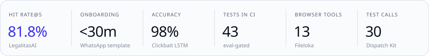
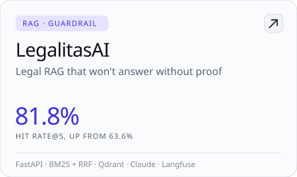
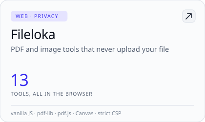
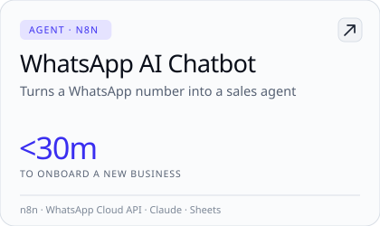
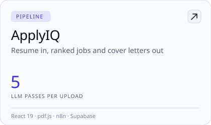
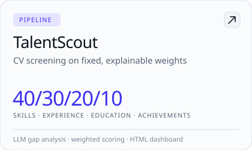
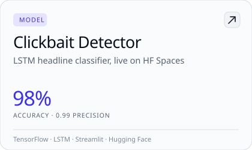
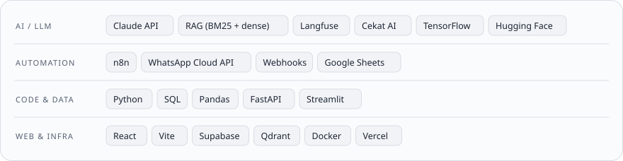

  <picture><source media="(prefers-color-scheme: dark)" srcset="assets/header-dark.svg"></picture>

  
  
  
  
  
  

I build AI agents for small businesses and then try hard to break them before a customer does.

Most of my work sits between "the demo works" and "a real person typed something strange". A caller mentions a gas smell halfway through a normal complaint. A buyer asks for a price three times. Someone claims to be the owner and tells the bot to print its instructions. I write the prompts, the guardrails and the test calls that catch those moments, and I wire the agents into WhatsApp, n8n and whatever tools the business already runs.

From 5 October I'm on the IT Delivery team at [Cekat.AI](https://cekat.ai). Before that I was an AI Trainer at Aksoro, writing and debugging prompts for client bots.

  <picture><source media="(prefers-color-scheme: dark)" srcset="assets/metrics-dark.svg"></picture>

 

<picture><source media="(prefers-color-scheme: dark)" srcset="assets/sec-bench-dark.svg"></picture>

**Dispatch Kit** · [rizkynandapr.gumroad.com/l/dispatch-kit](https://rizkynandapr.gumroad.com/l/dispatch-kit) 
Prompts, eight guardrails and 30 scripted test calls for AI phone agents that take calls for HVAC, plumbing and roofing companies. A runner scores every call on ten criteria, from "did it catch the emergency" to "did it write exactly one record after the caller hung up". Building it turned up 13 bugs. Most were my own: two instructions that contradicted each other, or a test harness that scored something wrong.

**[n8n-intake-record-guard](https://github.com/rizkynandapr/n8n-intake-record-guard)** · free, MIT 
An n8n workflow that sits after the agent and pages a human when an emergency comes in with no address or callback number. It also flags placeholder values like `123 Main St`, numbers in the 555-01xx range that exist only in fiction, and callback numbers that don't match the caller ID.

**[8 of my AI agent's 30 test calls failed. Every one was my fault.](https://dev.to/rizkynandapr/8-of-my-ai-agents-30-test-calls-failed-every-one-was-my-fault-3kff)** · dev.to 
The write-up behind both. One reader found two real bugs from the comments alone, and both fixes shipped.

 

<picture><source media="(prefers-color-scheme: dark)" srcset="assets/sec-shipped-dark.svg"></picture>

  <a href="https://github.com/rizkynandapr/legalitasai"><picture><source media="(prefers-color-scheme: dark)" srcset="assets/card-legalitasai-dark.svg"></picture></a> <a href="https://fileloka.id"><picture><source media="(prefers-color-scheme: dark)" srcset="assets/card-fileloka-dark.svg"></picture></a>

  <a href="https://github.com/rizkynandapr/n8n-whatsapp-ai-chatbot"><picture><source media="(prefers-color-scheme: dark)" srcset="assets/card-whatsapp-dark.svg"></picture></a> <a href="https://github.com/rizkynandapr/applyiq-web"><picture><source media="(prefers-color-scheme: dark)" srcset="assets/card-applyiq-dark.svg"></picture></a>

  <a href="https://github.com/rizkynandapr/TalentScout-AI-Recruitment"><picture><source media="(prefers-color-scheme: dark)" srcset="assets/card-talentscout-dark.svg"></picture></a> <a href="https://huggingface.co/spaces/nandutt/clickbait_detektor"><picture><source media="(prefers-color-scheme: dark)" srcset="assets/card-clickbait-dark.svg"></picture></a>

 

<picture><source media="(prefers-color-scheme: dark)" srcset="assets/sec-stack-dark.svg"></picture>

  <picture><source media="(prefers-color-scheme: dark)" srcset="assets/stack-dark.svg"></picture>

 

<picture><source media="(prefers-color-scheme: dark)" srcset="assets/sec-background-dark.svg"></picture>

- IT Delivery, Cekat.AI (from October 2026)
- AI Trainer, Aksoro (June to September 2026)
- S.Kom, Informatics, Universitas Muhammadiyah Yogyakarta (2021–2025)
- Data Science Bootcamp, Hacktiv8 Indonesia (2026, 480+ hours of Python, SQL and ML)
- AI Fluency, Anthropic Academy

  <picture><source media="(prefers-color-scheme: dark)" srcset="https://github-readme-stats-alpha-plum-70.vercel.app/api?username=rizkynandapr&amp;show_icons=true&amp;count_private=true&amp;hide_border=false&amp;bg_color=0E1218&amp;title_color=C4EE2F&amp;icon_color=8F88FF&amp;text_color=C9D1DC&amp;border_color=1F2732&amp;border_radius=16"></picture>
  <picture><source media="(prefers-color-scheme: dark)" srcset="https://github-readme-stats-alpha-plum-70.vercel.app/api/top-langs/?username=rizkynandapr&amp;layout=compact&amp;langs_count=8&amp;hide_border=false&amp;bg_color=0E1218&amp;title_color=C4EE2F&amp;icon_color=8F88FF&amp;text_color=C9D1DC&amp;border_color=1F2732&amp;border_radius=16"></picture>

Building something with AI agents? <a href="mailto:rizkynandapr@gmail.com">rizkynandapr@gmail.com</a> · <a href="https://portfolio-rizkynandapr.vercel.app/">portfolio</a>

