<p align="center">
  
</p>

<p align="center">
  <a href="https://rizkynandapr.vercel.app"></a>
  <a href="https://dev.to/rizkynandapr"></a>
  <a href="https://www.linkedin.com/in/rizky-nanda-praditia/"></a>
  <a href="https://huggingface.co/nandutt"></a>
</p>

I build AI agents for small businesses and then try hard to break them before a customer does.

Most of my work sits between "the demo works" and "a real person typed something strange". A caller mentions a gas smell halfway through a normal complaint. A buyer asks for a price three times. Someone claims to be the owner and tells the bot to print its instructions. I write the prompts, the guardrails and the test calls that catch those moments, and I wire the agents into WhatsApp, n8n and whatever tools the business already runs.

```text
based in    Indonesia (UTC+7)
building    intake agents, eval suites, n8n automations, WhatsApp bots
background  informatics degree, data science bootcamp, a lot of production logs
```

## On the bench right now

**Dispatch Kit** · [rizkynandapr.gumroad.com/l/dispatch-kit](https://rizkynandapr.gumroad.com/l/dispatch-kit)<br>
Prompts, eight guardrails and 30 scripted test calls for AI phone agents that take calls for HVAC, plumbing and roofing companies. A runner scores every call on ten criteria, from "did it catch the emergency" to "did it write exactly one record after the caller hung up". Building it turned up 13 bugs. Most were my own: two instructions that contradicted each other, or a test harness that scored something wrong.

**[n8n-intake-record-guard](https://github.com/rizkynandapr/n8n-intake-record-guard)** · free, MIT<br>
An n8n workflow that sits after the agent and pages a human when an emergency comes in with no address or callback number. It also flags placeholder values like `123 Main St`, numbers in the 555-01xx range that exist only in fiction, and callback numbers that don't match the caller ID.

**[8 of my AI agent's 30 test calls failed. Every one was my fault.](https://dev.to/rizkynandapr/8-of-my-ai-agents-30-test-calls-failed-every-one-was-my-fault-3kff)** · dev.to<br>
The write-up behind both. One reader found two real bugs from the comments alone, and both fixes shipped.

## Earlier work

<table>
<tr>
<td width="50%" valign="top">

**[LegalitasAI](https://github.com/rizkynandapr/legalitasai)**
<sub>RAG · FastAPI · BM25 + RRF · Claude · Langfuse</sub>

Answers regulation questions for Indonesian small businesses and refuses to answer without proof. Every claim must cite the Pasal and Ayat, and a validator checks the citation exists before the answer goes out. Filtering revoked regulations inside the ranking step raised Hit Rate@5 from 63.6% to 81.8%. 43 tests, CI with an eval gate, 7 ADRs.

</td>
<td width="50%" valign="top">

**[WhatsApp AI chatbot for SMBs](https://github.com/rizkynandapr/n8n-whatsapp-ai-chatbot)**
<sub>n8n · WhatsApp Cloud API · Claude API · Google Sheets</sub>

Started with my cousin's raincoat business drowning in WhatsApp orders every rainy season. The template answers with conversation memory, logs complete orders to Sheets, pings the owner and follows up on leads that went quiet. Everything client-specific lives in one node, so a new business is live in under 30 minutes.

</td>
</tr>
<tr>
<td width="50%" valign="top">

**[ApplyIQ](https://github.com/rizkynandapr/applyiq-web)**
<sub>React 19 · Vite · n8n · Supabase · LLM</sub>

Matches a resume to job listings worth applying for and drafts a cover letter for each. The resume is parsed in the browser with pdf.js and mammoth, so the raw file never leaves the device. An n8n pipeline scores each listing and the results land on a Supabase dashboard.

</td>
<td width="50%" valign="top">

**[TalentScout](https://github.com/rizkynandapr/TalentScout-AI-Recruitment)**
<sub>workflow automation · prompt engineering · LLM</sub>

Takes a CV and a job description, runs an LLM gap analysis, and scores fit on fixed weights: 40% hard skills, 30% experience, 20% education, 10% achievements. Every candidate is judged the same way, and the output is a dashboard a hiring manager can act on.

</td>
</tr>
<tr>
<td width="50%" valign="top">

**[Clickbait Detector](https://github.com/rizkynandapr/clickbait-detector)**
<sub>TensorFlow · LSTM · Streamlit · Hugging Face Spaces</sub>

An LSTM trained on about 32k balanced headlines: roughly 98% accuracy and 0.99 precision on the clickbait class. [Try it live](https://huggingface.co/spaces/nandutt/clickbait_detektor) with your own headline.

</td>
<td width="50%" valign="top">

**Toolbox**

`Python` `SQL` `pandas` `TensorFlow` `FastAPI`
`Claude API` `n8n` `Cekat` `Hugging Face`
`React` `Supabase` `Docker` `Vercel`

</td>
</tr>
</table>

## Background

- S.Kom, Informatics, Universitas Muhammadiyah Yogyakarta (2021–2025)
- Data Science Bootcamp, Hacktiv8 Indonesia (2026, 480+ hours of Python, SQL and ML)
- AI Fluency, Anthropic Academy

<p align="center">
  
  
</p>

<p align="center"><sub>Say hi: <a href="mailto:rizkynandapr@gmail.com">rizkynandapr@gmail.com</a></sub></p>
